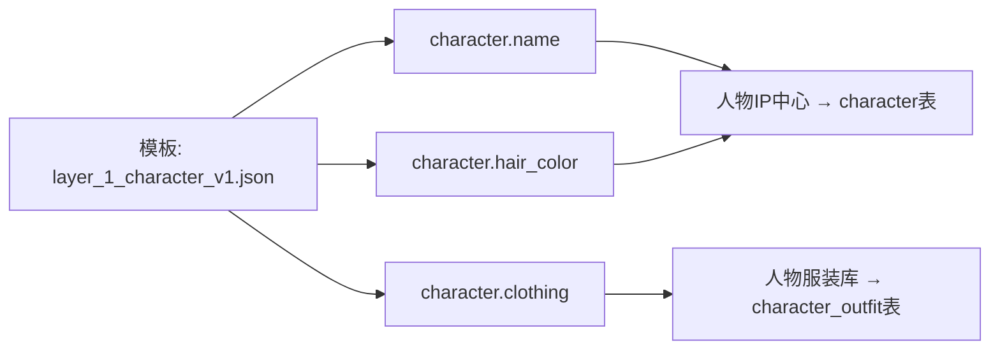

# AI Webtoon Factory — Prompt 设计规范文档

> 版本：v1.0  
> 最后更新：2026-06-27  
> 状态：正式

---

## 1. Prompt 层级体系

### 1.1 五层体系总览

```
Level 1: System Prompt (系统级)
  └── 定义 AI 角色的行为边界和输出规范
  └── 所有 Agent 共用的基础角色设定
  └── 全局不可变，仅系统管理员可修改

Level 2: Developer Prompt (开发者级)
  └── 定义应用特定的处理规则和业务逻辑
  └── 每个 Agent 独有的专业领域知识
  └── 如拆分规则、镜头规则、版式规则

Level 3: Template Prompt (模板级)
  └── 定义模块化的 Prompt 模板，含变量占位符
  └── 10 层生图 Prompt 模板（按层独立存储）
  └── 版本化管理，支持多模板切换

Level 4: Runtime Prompt (运行时级)
  └── 模板实例化后的具体 Prompt
  └── 变量已替换为实际数据
  └── 尚未发送给 LLM，用于预览和测试

Level 5: Executed Prompt (执行级)
  └── 实际发送给 LLM 的完整 Prompt 字符串
  └── 包含 System + Developer + 实例化后的 Template
  └── 记录在数据库，用于追溯和调试
```

### 1.2 层级关系图

```
                    System Prompt (全局基础)
                           │
                    Developer Prompt (Agent 特有)
                           │
                    ┌──────┴──────┐
                    │             │
           Template Prompt    Template Prompt
           (v1.0 - 标准)      (v1.1 - 增强)
                    │             │
                    └──────┬──────┘
                           │
                    Runtime Prompt
                    (变量已替换)
                           │
                    Executed Prompt
                    (记录到日志)
```

### 1.3 System Prompt 规范

**内容组成**：

```
1. 角色设定 (Role Definition)
   你是一个{专业领域}助手，你的任务是需要...

2. 输出格式约束 (Output Format)
   输出必须为严格的 JSON 格式，不要包含任何额外说明文字。
   字段说明：...

3. 行为边界 (Behavior Boundaries)
   - 不要猜测不确定的信息
   - 遇到格式错误时尝试修正后输出
   - 不要省略任何必填字段
   - 如果输入数据不足以完成任务，请按规则输出最合理的默认值
```

**全局共享规则**：

| 规则 | 内容 |
|------|------|
| **JSON 强制输出** | 所有 Agent 的输出必须是合法 JSON，不得包含 Markdown 代码块标记（如 ```json） |
| **异常处理** | 遇到无法识别的输入时，保留原内容不做修改，在 meta 中标记 |
| **语言一致性** | 输入为中文时，输出字段值使用中文；输入为英文时使用英文 |
| **禁止引入外部知识** | 只基于输入文本分析，不要引入未提供的设定信息 |
| **敏感内容过滤** | 输出中不得包含暴力/色情/政治敏感内容 |

### 1.4 Template Prompt 规范

**变量语法**：
- 使用 `{{variable_name}}` 语法定义变量
- 变量名采用 snake_case 命名
- 变量名以命名空间前缀开头：`character.`、`scene.`、`camera.` 等
- 支持带默认值的变量：`{{character.name|默认值}}`

**模板分类体系**：

```
prompts/
├── system/                          # Level 1: System Prompt
│   ├── base_system_v1.json          # 全局基础 System Prompt
│   ├── text_cleaner_system_v1.json
│   ├── story_analyzer_system_v1.json
│   └── ...
│
├── developer/                       # Level 2: Developer Prompt
│   ├── text_cleaner_dev_v1.json
│   ├── story_analyzer_dev_v1.json
│   └── ...
│
├── templates/                       # Level 3: Template Prompt
│   ├── text_cleaner/
│   │   └── clean_text_v1.json
│   ├── story_analyzer/
│   │   ├── scene_extraction_v1.json
│   │   └── scene_extraction_v2.json
│   ├── semantic_splitter/
│   │   └── split_scene_v1.json
│   ├── storyboard_planner/
│   │   └── generate_storyboard_v1.json
│   ├── camera_planner/
│   │   └── plan_camera_v1.json
│   ├── layout_planner/
│   │   └── plan_layout_v1.json
│   ├── bubble_planner/
│   │   └── plan_bubble_v1.json
│   └── prompt_generator/            # 10 层生图 Prompt 模板
│       ├── layer_1_character_v1.json
│       ├── layer_2_environment_v1.json
│       ├── layer_3_action_v1.json
│       ├── layer_4_emotion_v1.json
│       ├── layer_5_camera_v1.json
│       ├── layer_6_lighting_v1.json
│       ├── layer_7_composition_v1.json
│       ├── layer_8_webtoon_style_v1.json
│       ├── layer_9_bubble_v1.json
│       ├── layer_10_negative_v1.json
│       └── prompt_assembly_config.json  # 组装配置（顺序、分隔符等）
│
└── variables/                       # 变量定义
    ├── character_variables.json
    ├── scene_variables.json
    ├── camera_variables.json
    └── style_variables.json
```

**模板版本号**：`v{major}.{minor}.{patch}`

| 版本位 | 变更类型 | 示例 |
|--------|----------|------|
| major | 结构变更、字段增删、不兼容变动 | v2.0.0 |
| minor | 新增变量、规则优化、兼容性变更 | v1.1.0 |
| patch | 措辞修正、示例更新、无功能影响 | v1.0.1 |

---

## 2. Prompt 命名规范

### 2.1 文件命名规则

```
格式: {agent_id}/{template_name}_v{version}.json

示例:
  story_analyzer/scene_extraction_v1.2.json
  camera_planner/plan_camera_v1.0.json
  prompt_generator/layer_1_character_v2.1.json

规则:
  1. agent_id: 使用 Agent 的 ID（snake_case）
  2. template_name: 使用描述性的英文名称（snake_case）
  3. version: 使用语义化版本号（major.minor.patch）
  4. 全部小写字母
  5. 使用下划线分隔单词
```

### 2.2 模板内部 JSON 结构

```json
{
  "meta": {
    "template_id": "story_analyzer/scene_extraction_v1.2",
    "name": "Scene Extraction",
    "agent_id": "story_analyzer",
    "version": "1.2.0",
    "author": "system",
    "created_at": "2026-06-01T00:00:00Z",
    "updated_at": "2026-06-27T00:00:00Z",
    "description": "从章节文本中提取场景结构的基础模板",
    "compatible_models": ["gpt-4", "gpt-4o", "deepseek-chat"],
    "variables": ["chapter_title", "paragraphs_with_numbers", "world_building_info", "character_list"],
    "tags": ["story_analysis", "scene_extraction"]
  },
  "prompt": {
    "system": "你是一个专业的漫画剧情分析助手。...",
    "user": "请分析以下章节文本，提取场景（Scene）结构。\n\n章节标题：{{chapter_title}}\n\n文本（已分段落）：\n{{paragraphs_with_numbers}}\n\n..."
  },
  "output_schema": {
    "$schema": "http://json-schema.org/draft-07/schema#",
    "type": "object",
    "required": ["chapter_id", "scenes", "plot_structure", "meta"],
    "properties": { ... }
  },
  "samples": [
    {
      "input": { "chapter_title": "...", "paragraphs": [...] },
      "output": { "scenes": [...], "plot_structure": {...} }
    }
  ]
}
```

### 2.3 变量命名规范

| 命名空间 | 前缀 | 示例变量 | 数据来源 |
|----------|------|----------|----------|
| 角色 | `character.` | `character.name`, `character.hair_color` | 人物 IP 中心 |
| 场景 | `scene.` | `scene.location`, `scene.time_of_day` | 世界观资产库 |
| 画格 | `panel.` | `panel.action`, `panel.emotion` | 分镜数据 |
| 镜头 | `camera.` | `camera.type`, `camera.angle` | 镜头规划数据 |
| 风格 | `style.` | `style.art_style`, `style.coloring_style` | 风格模板库 |
| 气泡 | `bubble.` | `bubble.type`, `bubble.position` | 气泡规划数据 |
| 用户 | `user.` | `user.negative_prompt_extra` | 用户设置 |
| 系统 | `system.` | `system.negative_default` | 系统预设 |

---

## 3. 10 层生图 Prompt 结构

### Layer 1: Character (角色层)

| 项目 | 内容 |
|------|------|
| **数据来源** | 人物 IP 中心（`character` 表） |
| **功能** | 定义画面中出现的所有角色的外观特征 |
| **LLM 策略** | 不需要 LLM，直接从数据库读取特征描述 |

**变量映射表**：

| 模板变量 | 数据库字段 | 说明 | 默认值 |
|----------|-----------|------|--------|
| `{{character.name}}` | `character.name` | 角色名称 | - |
| `{{character.appearance}}` | `character.appearance` | 整体外貌描述 | "a young man" |
| `{{character.hair_color}}` | `character.hair_color` | 发色 | "black" |
| `{{character.hair_style}}` | `character.hair_style` | 发型 | "short hair" |
| `{{character.eye_color}}` | `character.eye_color` | 瞳色 | "brown" |
| `{{character.skin_tone}}` | `character.skin_tone` | 肤色 | "fair skin" |
| `{{character.clothing}}` | `character.clothing` | 服装描述 | "casual clothes" |
| `{{character.key_features}}` | `character.key_features` | 关键特征（伤疤/饰品等） | "" |

**模板示例**：

```
{{character.name}}, {{character.appearance}}, 
{{character.hair_color}} {{character.hair_style}}, 
{{character.eye_color}} eyes, 
{{character.skin_tone}}, 
wearing {{character.clothing}}{{character.key_features}}
```

**组装逻辑**：
1. 从 Panel 的 `characters` 字段获取当前 Panel 涉及的角色 ID 列表
2. 对每个角色 ID 查询 `character` 表获取特征数据
3. 如果 Panel 涉及多个角色，按角色先后顺序拼接，用 "and" / "旁边是" 连接
4. 角色特征缺失时使用默认值
5. 如果 `key_features` 为空，跳过该部分描述

---

### Layer 2: Environment (环境层)

| 项目 | 内容 |
|------|------|
| **数据来源** | 世界观资产库（`scene_asset` 表）+ Scene 分析结果 |
| **功能** | 定义画面发生的环境、天气、时间、季节和氛围 |

**变量映射表**：

| 模板变量 | 数据库字段 | 说明 | 默认值 |
|----------|-----------|------|--------|
| `{{scene.location}}` | `scene_asset.name` | 地点名称 | "an indoor scene" |
| `{{scene.weather}}` | `scene_asset.weather` | 天气状况 | "clear" |
| `{{scene.time_of_day}}` | `scene_asset.time_of_day` | 时间 | "daytime" |
| `{{scene.season}}` | `scene_asset.season` | 季节 | "spring" |
| `{{scene.atmosphere}}` | `scene_asset.atmosphere` | 氛围描述 | "neutral atmosphere" |

**模板示例**：

```
Location: {{scene.location}}, {{scene.time_of_day}}, {{scene.season}}.
Weather: {{scene.weather}}. Atmosphere: {{scene.atmosphere}}.
```

**组装逻辑**：
1. 从 Scene 数据中获取 `location` 字段
2. 在 `scene_asset` 表中匹配对应的场景资产记录
3. 如未匹配到，从 Scene 分析结果中提取环境描述
4. 时间/季节信息优先从 Scene 分析结果获取

---

### Layer 3: Action (动作层)

| 项目 | 内容 |
|------|------|
| **数据来源** | 分镜数据（`panel.storyboard_data` 字段） |
| **功能** | 描述画面中角色的具体动作和姿态 |

**变量映射表**：

| 模板变量 | 数据来源路径 | 说明 | 默认值 |
|----------|-------------|------|--------|
| `{{panel.action}}` | `panel.storyboard_data.action` | 动作描述 | "standing" |
| `{{panel.characters_action}}` | `panel.storyboard_data.characters_action` | 各角色具体动作 | "" |
| `{{panel.action_intensity}}` | `panel.storyboard_data.action_intensity` | 动作强度 | "normal" |

**模板示例**：

```
{{panel.characters_action}}, {{panel.action_intensity}} movement
```

**组装逻辑**：
1. 从 `panel.storyboard_data` 提取动作描述
2. 如果 Panel 中有多个角色，依次输出每个角色的动作
3. 动作强度影响描述用词（如 "gently" / "forcefully"）

---

### Layer 4: Emotion (情绪层)

| 项目 | 内容 |
|------|------|
| **数据来源** | 剧情分析数据（`scene.emotion`）+ 分镜数据（`panel.emotion`） |
| **功能** | 定义角色的面部表情和情绪氛围 |

**变量映射表**：

| 模板变量 | 数据来源路径 | 说明 | 默认值 |
|----------|-------------|------|--------|
| `{{panel.emotion}}` | `panel.emotion` | Panel 级别的情绪 | "neutral" |
| `{{scene.mood}}` | `scene.emotion.mood` | 场景整体情绪基调 | "neutral" |
| `{{panel.expression}}` | `panel.emotion.expression` | 面部表情描述 | "" |

**模板示例**：

```
Mood: {{scene.mood}}. Expression: {{panel.expression}}.
```

**组装逻辑**：
1. 优先使用 Panel 级别的情绪数据（粒度更细）
2. 如果 Panel 没有独立情绪数据，使用 Scene 级别的情绪
3. 情绪描述映射为生图模型能理解的视觉描述（如 "angry" → "frowning, glaring"）

---

### Layer 5: Camera (镜头层)

| 项目 | 内容 |
|------|------|
| **数据来源** | 镜头规划数据（`panel.camera_data` 字段） |
| **功能** | 定义镜头类型、角度、运镜方式和景别 |

**变量映射表**：

| 模板变量 | 数据来源路径 | 说明 | 默认值 |
|----------|-------------|------|--------|
| `{{panel.camera_type}}` | `panel.camera_data.camera_type` | 镜头类型 | "medium_shot" |
| `{{panel.camera_angle}}` | `panel.camera_data.camera_angle` | 镜头角度 | "eye_level" |
| `{{panel.camera_movement}}` | `panel.camera_data.camera_movement` | 运镜方式 | "fixed" |
| `{{panel.shot_size}}` | `panel.camera_data.shot_size` | 景别 | "medium" |

**模板示例**：

```
{{panel.camera_type}}, {{panel.camera_angle}} angle, {{panel.camera_movement}} camera
```

**层间交互**：
- 镜头层影响构图层：中景 + 平视 → 适合三分法构图
- 镜头层影响环境层：远景需要更详细的环境描述
- 在 Prompt 中的位置：位于角色和动作之后，光线和构图之前

---

### Layer 6: Lighting (光线层)

| 项目 | 内容 |
|------|------|
| **数据来源** | 场景设定（`scene_asset`）+ 镜头规划（`panel.camera_data`） |
| **功能** | 定义场景的光照风格、方向和颜色 |

**变量映射表**：

| 模板变量 | 数据来源路径 | 说明 | 默认值 |
|----------|-------------|------|--------|
| `{{scene.lighting}}` | `scene_asset.lighting_style` | 光照风格 | "ambient lighting" |
| `{{panel.lighting_emphasis}}` | `panel.lighting_emphasis` | 光线强调 | "" |
| `{{scene.lighting_direction}}` | `scene_asset.lighting_direction` | 光照方向 | "top_down" |
| `{{scene.lighting_color}}` | `scene_asset.lighting_color` | 光色 | "warm" |

**模板示例**：

```
Lighting: {{scene.lighting}}, {{scene.lighting_direction}}, {{scene.lighting_color}} tones
, emphasizing {{panel.lighting_emphasis}}
```

**组装逻辑**：
1. 从场景资产获取基础光照设定
2. 如果 Panel 有特殊光线强调（如 "逆光剪影"、"霓虹灯照射"），追加到描述中
3. 情绪场景会影响光线选择：悲伤场景 → 冷色调、低对比；欢乐场景 → 暖色调、高对比

---

### Layer 7: Composition (构图层)

| 项目 | 内容 |
|------|------|
| **数据来源** | 分镜规划数据（`panel.storyboard_data`） |
| **功能** | 定义画面构图方式、视觉焦点和背景处理 |

**变量映射表**：

| 模板变量 | 数据来源路径 | 说明 | 默认值 |
|----------|-------------|------|--------|
| `{{panel.composition}}` | `panel.storyboard_data.composition` | 构图方式 | "center composition" |
| `{{panel.focus}}` | `panel.storyboard_data.focus` | 视觉焦点 | "main subject" |
| `{{panel.background}}` | `panel.storyboard_data.background` | 背景描述 | "simple background" |

**模板示例**：

```
Composition: {{panel.composition}}. Focus on {{panel.focus}}. 
Background: {{panel.background}}.
```

**组装逻辑**：
1. 分镜数据中的构图描述直接转为 Prompt 的构图层
2. 如果未指定构图方式，根据镜头类型自动推荐：
   - 特写 → 中心构图
   - 远景 → 三分法构图
   - 双人对话 → 对称构图

---

### Layer 8: Webtoon Style (画风层)

| 项目 | 内容 |
|------|------|
| **数据来源** | 风格模板库（`style_template` 表） |
| **功能** | 定义漫画的整体视觉风格，包括画风、上色方式、线条风格 |

**变量映射表**：

| 模板变量 | 数据来源路径 | 说明 | 默认值 |
|----------|-------------|------|--------|
| `{{style.art_style}}` | `style_template.art_style` | 画风 | "webtoon style" |
| `{{style.coloring_style}}` | `style_template.coloring_style` | 上色风格 | "cell shading" |
| `{{style.lineart_style}}` | `style_template.lineart_style` | 线条风格 | "clean lines" |
| `{{style.detail_level}}` | `style_template.detail_level` | 细节程度 | "moderate detail" |

**模板示例**：

```
{{style.art_style}}, {{style.coloring_style}}, {{style.lineart_style}}, {{style.detail_level}}
```

**组装逻辑**：
1. 从项目关联的风格模板中读取画风配置
2. 画风层通常在所有正向描述层的末尾，负向层之前
3. 此层在整个项目中保持一致，不随 Panel 内容变化

---

### Layer 9: Bubble (气泡层)

| 项目 | 内容 |
|------|------|
| **数据来源** | 气泡规划数据（`bubble` 表） |
| **功能** | 描述画面中气泡的类型、位置和内容 |

**变量映射表**：

| 模板变量 | 数据来源路径 | 说明 | 默认值 |
|----------|-------------|------|--------|
| `{{panel.bubble_descriptions}}` | 聚合 `bubble` 表数据 | 气泡描述集合 | "" |

**模板示例**：

```

{{bubble.type}} bubble at {{bubble.position}} position

```

**组装逻辑**：
1. 查询当前 Panel 关联的所有气泡
2. 按阅读顺序（`bubble.order`）排列
3. 每个气泡输出类型和位置建议
4. 如果 Panel 没有气泡（纯画面无文本），跳过此层

---

### Layer 10: Negative (负向层)

| 项目 | 内容 |
|------|------|
| **数据来源** | 系统预设 + 用户自定义（`style_template.negative_prompt` + `user_settings.custom_negative`） |
| **功能** | 定义生图模型应该避免生成的内容 |

**变量映射表**：

| 模板变量 | 数据来源路径 | 说明 | 默认值 |
|----------|-------------|------|--------|
| `{{style.negative_prompt}}` | `style_template.negative_prompt` | 风格预设负向 | "nsfw, worst quality, low quality" |
| `{{user.negative_prompt_extra}}` | `user_settings.custom_negative` | 用户额外负向 | "" |

**模板示例**（默认值）：

```
{{style.negative_prompt}}, {{user.negative_prompt_extra}}
```

**系统预设负向 Prompt**（项目级别默认）：

```
nsfw, worst quality, low quality, normal quality, lowres, bad anatomy,
bad hands, extra fingers, missing fingers, bad proportions, distorted face,
ugly, blurry, watermark, signature, text, out of frame, cropped
```

**组装逻辑**：
1. 从风格模板中加载默认负向 Prompt
2. 合并用户自定义的额外负向 Prompt
3. 两层以 ", " 拼接
4. 负向 Prompt 单独作为生图 API 的 `negative_prompt` 参数发送，不混入正向 Prompt

---

## 4. Prompt 变量系统

### 4.1 系统变量命名空间

| 命名空间 | 说明 | 数据来源模块 | 示例 |
|----------|------|-------------|------|
| `character.*` | 角色属性 | 人物 IP 中心 | `character.hair_color` |
| `scene.*` | 场景属性 | 世界观资产库 | `scene.location` |
| `panel.*` | 画格属性 | 分镜数据 | `panel.action` |
| `camera.*` | 镜头属性 | 镜头规划数据 | `camera.type` |
| `style.*` | 画风属性 | 风格模板库 | `style.art_style` |
| `bubble.*` | 气泡属性 | 气泡规划数据 | `bubble.type` |
| `user.*` | 用户自定义 | 用户设置 | `user.negative_prompt_extra` |
| `system.*` | 系统预设 | 系统默认配置 | `system.negative_default` |

### 4.2 用户自定义变量

用户可以通过 Prompt 中心（`PRD/10-Prompt中心.md`）自定义变量值：

- **变量值编辑**：在 Prompt 编辑器界面中修改任意变量的值
- **用户变量优先级**：用户自定义值 > 数据源值 > 默认值
- **变量锁定**：用户可以锁定某些变量，使其在所有模板中固定不变

### 4.3 变量引用关系追踪



**追踪实现**：

```json
// 变量解析日志（记录在 Prompt 输出的 meta 中）
{
  "variable_resolution_log": [
    {
      "variable": "character.hair_color",
      "resolved": true,
      "source": "character.hair_color",
      "source_table": "character",
      "source_id": "uuid-of-character",
      "value_snippet": "black",
      "default_used": false
    },
    {
      "variable": "scene.weather",
      "resolved": false,
      "source": null,
      "source_table": null,
      "source_id": null,
      "value_snippet": "clear (default)",
      "default_used": true
    }
  ]
}
```

### 4.4 变量缺失时的默认值策略

| 场景 | 策略 |
|------|------|
| 变量在数据源中存在但为空字符串 | 使用模板中定义的默认值（`{{var\|default_value}}`） |
| 变量在数据源中不存在（字段为 null） | 使用模板中定义的默认值 |
| 整个数据源表无匹配记录 | 跳过该层，不在 Prompt 中注入空白内容 |
| 必需变量（如角色名）缺失 | 标记为异常，记录到变量解析日志的 errors 中 |

---

## 5. Prompt 版本管理

### 5.1 版本号规范

```
v{major}.{minor}.{patch}

major: 结构变更、字段增删、不兼容变动
minor: 新增变量、规则优化、兼容性变更
patch: 措辞修正、示例更新、无功能影响
```

### 5.2 版本存储

```sql
-- prompts 表结构（版本记录）
CREATE TABLE prompts (
    id UUID PRIMARY KEY DEFAULT gen_random_uuid(),
    panel_id UUID NOT NULL REFERENCES panels(id),
    template_id VARCHAR(255) NOT NULL,          -- 使用的模板 ID
    prompt_version VARCHAR(20) NOT NULL,        -- Prompt 版本号
    content JSONB NOT NULL,                      -- 完整 Prompt 内容（10 层结构）
    merged_prompt TEXT NOT NULL,                 -- 合并后的正向 Prompt
    negative_prompt TEXT NOT NULL,               -- 负向 Prompt
    params JSONB NOT NULL,                       -- 生成参数（width, height, cfg等）
    variable_resolution_log JSONB,               -- 变量解析日志
    status VARCHAR(20) DEFAULT 'active',         -- active / archived / deprecated
    created_at TIMESTAMPTZ DEFAULT NOW(),
    superseded_by UUID REFERENCES prompts(id)    -- 被哪个新版本替代
);

CREATE INDEX idx_prompts_panel_version ON prompts(panel_id, prompt_version DESC);
```

### 5.3 版本对比

通过 `prompt_diff` 工具函数实现逐层差异比对：

```python
def prompt_diff(prompt_a: dict, prompt_b: dict) -> list[dict]:
    """
    对比两个 Prompt 版本的差异，返回逐层的 diff 列表。
    
    返回格式：
    [
        {
            "layer": "1_character",
            "change_type": "modified",  # added / removed / modified / unchanged
            "old_snippet": "black hair",
            "new_snippet": "brown hair",
            "impact": "角色外观特征变更，影响一致性检查阈值"
        }
    ]
    """
```

### 5.4 版本回滚

```
回滚触发条件：
  1. 用户手动选择回滚（在 Prompt 版本历史中选择）
  2. A/B 测试结果显示旧版本质量评分更高（自动回滚，可选）

回滚流程：
  1. 目标版本的状态从 archived → active
  2. 当前版本的状态从 active → archived
  3. 重新生成 Prompt（标记为 old_version → new_version）
  4. 如果相关的图片已生成，标记为 "需重新生成"
```

### 5.5 版本标签

| 标签 | 含义 | 使用场景 |
|------|------|----------|
| `stable` | 稳定版 | 生产环境默认使用 |
| `beta` | 测试版 | 新功能验证阶段 |
| `deprecated` | 已废弃 | 不再推荐使用 |
| `archived` | 已归档 | 历史版本保留 |
| `active` | 当前活跃版 | 当前正在使用的版本 |

---

## 6. Prompt 测试框架

### 6.1 单次测试

```python
def run_single_test(
    template_id: str,
    version: str,
    test_input: dict,
    panel_id: str
) -> TestResult:
    """
    单次 Prompt 测试流程：
    1. 加载指定版本的 Prompt 模板
    2. 注入测试输入数据
    3. 调用 LLM（如果测试 LLM Agent 模板）
    4. 校验输出是否符合 Schema
    5. 记录测试结果
    """
```

**测试结果**：

```json
{
  "test_id": "uuid",
  "template_id": "story_analyzer/scene_extraction_v1.2",
  "test_type": "single",
  "input_snapshot": { ... },
  "output": { ... },
  "schema_valid": true,
  "execution_time_ms": 2450,
  "token_usage": { "prompt": 1200, "completion": 800, "total": 2000 },
  "passed": true
}
```

### 6.2 A/B 测试

```
A/B 测试场景：
  - 对比两个版本的 Agent Prompt（如 v1.0 vs v1.1）
  - 对比两个版本的 10 层生图 Prompt 模板（如 layer_1 的不同措辞）

流程：
  1. 选择 A（对照组）和 B（实验组）版本
  2. 选择测试数据（选定的章节或 Panel 列表）
  3. 分别用 A 和 B 版本执行完整的 Agent 管线
  4. 收集对比数据：
     a. 输出质量评分（由 QualityScorer 评估）
     b. 执行耗时
     c. Token 消耗
     d. Schema 校验通过率
  5. 生成 A/B 测试报告

A/B 测试报告格式：
  {
    "test_id": "ab_test_001",
    "template": "story_analyzer/scene_extraction",
    "a_version": "1.0.0",
    "b_version": "1.1.0",
    "test_data_size": 10,
    "results": {
      "a": {
        "avg_quality_score": 82.5,
        "avg_execution_time_ms": 3100,
        "avg_token_usage": 2100,
        "schema_pass_rate": 0.95
      },
      "b": {
        "avg_quality_score": 87.3,
        "avg_execution_time_ms": 2900,
        "avg_token_usage": 1950,
        "schema_pass_rate": 0.98
      }
    },
    "recommendation": "B 版本在所有指标上优于 A，建议升级至 v1.1.0"
  }
```

### 6.3 批量回归测试

```python
def run_regression_test(
    template_id: str,
    new_version: str,
    test_dataset: list[dict],  # 包含 N 组测试输入
    baseline_version: str
) -> RegressionReport:
    """
    批量回归测试：
    1. 在预设的测试数据集上运行新版本
    2. 对比基线版本（当前 stable 版）的输出
    3. 检测性能退化
    4. 生成回归测试报告
    """
```

**回归测试数据集**：

测试数据集存储在 `test_data/` 目录下，覆盖各类场景：

| 测试场景 | 数据量 | 说明 |
|----------|--------|------|
| 短章节（1000 字） | 10 组 | 测试基础处理能力 |
| 中等章节（5000 字） | 10 组 | 主流场景 |
| 长章节（10000+ 字） | 5 组 | 测试长文本处理 |
| 对话密集型 | 5 组 | 测试对话识别 |
| 动作密集型 | 5 组 | 测试动作拆解 |
| 多人物场景 | 5 组 | 测试多人场景分析 |
| 异常输入（格式错误） | 3 组 | 测试容错能力 |

### 6.4 测试结果记录

```sql
CREATE TABLE prompt_test_results (
    id UUID PRIMARY KEY DEFAULT gen_random_uuid(),
    test_id VARCHAR(100) NOT NULL,          -- 测试标识
    test_type VARCHAR(20) NOT NULL,         -- single / ab / regression
    template_id VARCHAR(255) NOT NULL,
    version VARCHAR(20) NOT NULL,
    baseline_version VARCHAR(20),           -- 基线版本（用于 A/B 和回归测试）
    test_data_size INTEGER NOT NULL,
    passed BOOLEAN NOT NULL,
    
    -- 汇总指标
    avg_quality_score FLOAT,
    avg_execution_time_ms FLOAT,
    avg_token_usage FLOAT,
    schema_pass_rate FLOAT,
    
    -- 详细信息
    detailed_results JSONB,                 -- 逐条测试的详细结果
    report_summary TEXT,                    -- 文本摘要
    
    created_at TIMESTAMPTZ DEFAULT NOW(),
    created_by VARCHAR(100)
);
```

### 6.5 评分标准

| 测试类型 | 通过标准 |
|----------|----------|
| 单次测试 | Schema 校验通过 + LLM 调用成功 |
| A/B 测试 | B 版本在质量评分上不显著低于 A 版本 |
| 回归测试 | 新版本在质量评分上不低于基线版本 5% |
| 性能测试 | 执行时间不超过基线版本的 120% |

---

## 7. Prompt 管理流程

### 7.1 创建 Prompt 模板流程

```
步骤1: 需求提出
  └─ 用户/开发者提出新的 Prompt 模板需求
  └─ 填写模板需求表单：
      - 模板名称、适用 Agent
      - 目标 LLM 模型
      - 核心规则说明
      - 变量列表

步骤2: 模板编写
  └─ 在 Prompt 编辑器（前端）中创建模板
  └─ 编写 System Prompt 和 User Prompt
  └─ 定义变量占位符
  └─ 编写输出 JSON Schema
  └─ 提供 1-3 组样例输入/输出

步骤3: 单次测试
  └─ 运行单次测试验证模板可用性
  └─ 检查输出是否符合 Schema
  └─ 检查变量是否被正确替换
  └─ 如失败 → 返回步骤2修改

步骤4: 批量回归测试
  └─ 在回归测试数据集上运行
  └─ 对比当前 stable 版本
  └─ 如质量下降 → 返回步骤2修改

步骤5: 版本发布
  └─ 确定版本号（遵循语义化版本）
  └─ 设置版本标签为 "beta"
  └─ 写入 prompts 表
  └─ 通知相关开发者

步骤6: 灰度上线
  └─ 在 10% 的请求中使用新模板
  └─ 监控质量评分和执行耗时
  └─ 如无异常 → 逐步扩大到 50% → 100%
  └─ 版本标签改为 "stable"
  └─ 旧版本标签改为 "deprecated"
```

### 7.2 模板审核流程

```
审核角色：
  - 模板作者：创建和修改模板
  - 审核者（Reviewer）：检查模板质量和安全性
  - 管理员（Admin）：批准上线

审核清单：
  [ ] System Prompt 是否明确了角色和约束
  [ ] User Prompt 是否正确引用了变量
  [ ] 输出 Schema 是否完整定义了所有字段
  [ ] 输入/输出 Schema 是否与 Agent 定义一致
  [ ] 是否包含安全性和伦理约束
  [ ] 是否提供了样例数据
  [ ] 是否通过了回归测试
  [ ] 变量默认值是否合理
```

### 7.3 模板废弃流程

```
废弃触发条件：
  1. 新版本已 stable 运行超过 7 天无异常
  2. 模板存在重大缺陷无法修复
  3. 对应的 Agent 已废弃

废弃流程：
  1. 版本标签改为 "deprecated"
  2. 停止新请求使用此版本
  3. 已有引用此版本的记录保留不变（可追溯）
  4. 30 天后自动归档（标签改为 "archived"）
  5. 归档后仅用于历史追溯，不可用于新请求
```

### 7.4 Prompt 变量更新通知

```
变量变更触发通知：
  1. 角色特征修改（如主角更换服装）
  2. 场景设定修改
  3. 风格模板切换

当以上变量数据源发生变更时：
  1. 系统自动检测受影响的 Panel 列表
  2. 标记这些 Panel 的 Prompt 状态为 "stale"
  3. 通知用户："{N} 个 Panel 的 Prompt 因角色特征变更需要更新"
  4. 用户可选择：
     a. 一键重新生成所有受影响的 Prompt
     b. 逐个确认是否更新
     c. 忽略变更（保持当前 Prompt 版本）
```

---

## 8. 附录：生图 Prompt 完整示例

### 8.1 10 层示例输出

以下是一个 Panel 完整的 10 层生图 Prompt 示例：

```json
{
  "panel_id": "a1b2c3d4-...",
  "prompt_version": "v1.2.0",
  "layers": {
    "1_character": "Xiao Ming, a young man with short black hair, brown eyes, fair skin, wearing a black leather jacket and white t-shirt",
    "2_environment": "Location: a cozy coffee shop at evening, spring. Weather: rainy outside. Atmosphere: warm and intimate",
    "3_action": "Sitting at a table, holding a coffee cup, looking cautiously to the right, slight forward lean",
    "4_emotion": "Mood: tense anticipation. Expression: furrowed brows, tight lips, alert eyes",
    "5_camera": "Medium shot, eye-level angle, fixed camera",
    "6_lighting": "Warm ambient lighting from overhead lamps, cool blue fill light from window on the left, emphasizing facial expression",
    "7_composition": "Rule of thirds composition. Focus on Xiao Ming's facial expression. Background: blurred coffee shop interior with warm bokeh lights",
    "8_webtoon_style": "Webtoon style, semi-realistic, cell shading, clean lines, moderate detail",
    "9_bubble": "Empty speech bubble on right side, tail pointing left towards Xiao Ming",
    "10_negative": "nsfw, worst quality, low quality, lowres, bad anatomy, bad hands, extra fingers, missing fingers, distorted face, ugly, blurry, watermark, signature, text"
  },
  "merged_prompt": "Xiao Ming, a young man with short black hair, brown eyes, fair skin, wearing a black leather jacket and white t-shirt, Location: a cozy coffee shop at evening, spring. Weather: rainy outside. Atmosphere: warm and intimate, Sitting at a table, holding a coffee cup, looking cautiously to the right, slight forward lean, Mood: tense anticipation. Expression: furrowed brows, tight lips, alert eyes, Medium shot, eye-level angle, fixed camera, Warm ambient lighting from overhead lamps, cool blue fill light from window on the left, emphasizing facial expression, Rule of thirds composition. Focus on Xiao Ming's facial expression. Background: blurred coffee shop interior with warm bokeh lights, Webtoon style, semi-realistic, cell shading, clean lines, moderate detail, Empty speech bubble on right side, tail pointing left towards Xiao Ming",
  "negative_prompt": "nsfw, worst quality, low quality, lowres, bad anatomy, bad hands, extra fingers, missing fingers, distorted face, ugly, blurry, watermark, signature, text",
  "params": {
    "width": 1080,
    "height": 1440,
    "cfg_scale": 7.5,
    "steps": 30,
    "seed": -1
  },
  "variable_resolution_log": [
    {"variable": "character.name", "resolved": true, "source": "character.name", "value_snippet": "Xiao Ming"},
    {"variable": "character.hair_color", "resolved": true, "source": "character.hair_color", "value_snippet": "black"},
    {"variable": "scene.lighting", "resolved": true, "source": "scene_asset.lighting", "value_snippet": "warm ambient lighting"},
    {"variable": "user.negative_prompt_extra", "resolved": false, "default_used": true, "source": null, "value_snippet": ""}
  ]
}
```

---

*本文档完*
